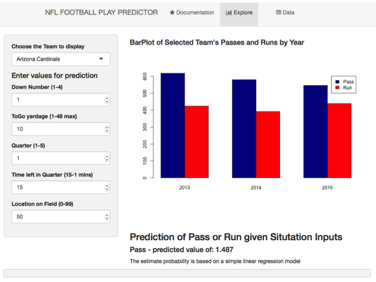

## Purpose of Play Prediction
The NFL Football Play Predictor was created both to satisfy the Coursera Developing Data Products project requirement, but also as a demonstration capability of how analytics can help teams better prepare, obtain a competitive edge, and help team management make more cost effective decisions.

- Preparation - by analyzing the play propensity of a given team, the defense is better prepared to know what their opponent will likely do overall and in a given certain game-time situation.  
- Edge - given that a defense is statistically prepared, they will know with a high degree of certainty that their opponent will pass instead of run in a certain situation, then they can unleash a devastating pass rush or if a run is more likely, they can 'stack the box' and stuff the run.    
- Big Data - transformative stuff.  Baseball has been using analytical stats for quite a while and even a major film ("Money Ball") was created illustrating this topic.   


--- .class #id 

## Application Overview
The NFL Football Play Predictor is a web application built using Slidify technology.  The app has 2 main features:

1. Based on the NFL team selected by the user, the app displays a bar plot of the Passes and Runs for the past 3 years.
2. The user can also enter various values corresponding to the Down, ToGo yards, Quarter, Time remaining (in the quarter), and the position on the field. With these variables, the tool predicts whether the selected team will execute a pass or run play using a simple linear regression model.

--- .class #id 

## App Screenshot

```r

```


--- .class #id 

## References and Further Information

The Play-by-Play data was freely obtained from:
- https://www.spreadsheet-sports.com/free-tools/2013-nfl-play-play-data-excel/

There is a pleathora of NFL stats and info. Here are a few additional links to sites with NFL databases and statistics:
- http://nflsavant.com/about.php
- http://www.advancedfootballanalytics.com/index.php
- http://www.armchairanalysis.com/index.php

Here is a nice article reasoning that Good Analytics programs are needed in every Sports Team's front office:
- http://www.advancedfootballanalytics.com/index.php/home/research/game-strategy/233-the-value-of-a-good-analytics-program


